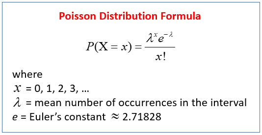
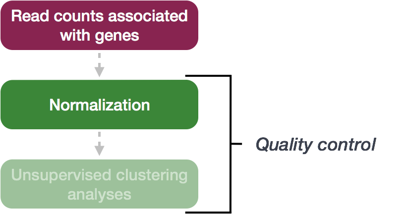
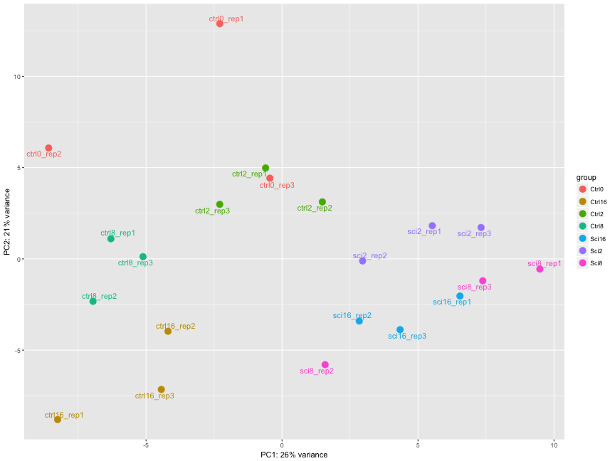
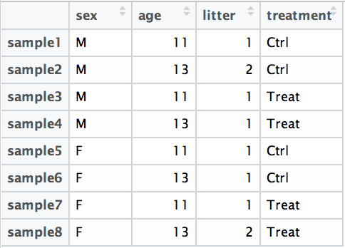
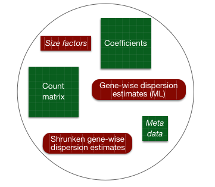
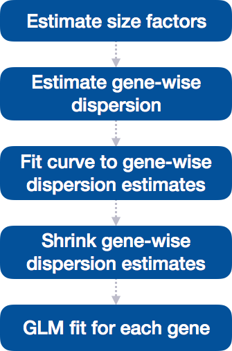
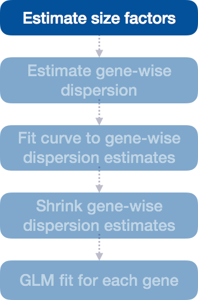
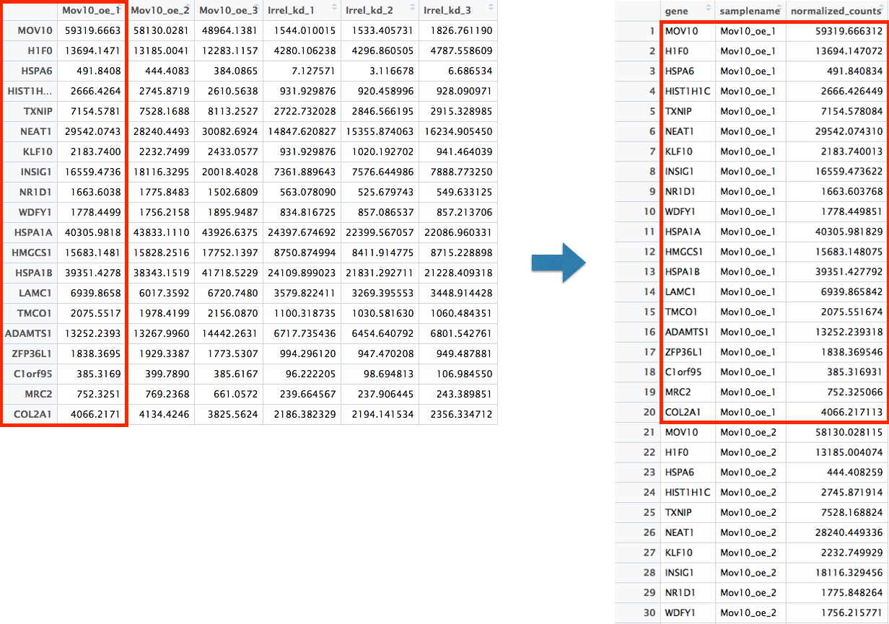

# Codebook

34 total points


```{r, include = FALSE}
knitr::opts_chunk$set(echo = TRUE, tidy = FALSE)
source("scripts/setup.R")
```
## DGE analysis overview

**.Rmd file = 01-DGE_setup_and_overview.Rmd**

### Setting up

#### Loading libraries; it's good practice to load them all at the beginning of your script.
```{r, message = FALSE}

library(tidyverse)
library(RColorBrewer)
library(DESeq2)
library(pheatmap)
library(ggplot2)
library(ggrepel)

```

#### Loading data
```{r}

data <- read.table("data/Mov10_full_counts.txt", 
                   header = TRUE, row.names = 1, 
                   sep= "\t")

 
```

Use class() to inspect our data and make sure we are working with data frames:
```{r}
### Check classes of the data we just brought in
class(meta)
class(data)
```

#### Viewing data

```{r}

rownames(meta)

colnames(data)

data[1:4,1:4]

```

You’ll notice that the `colnames` of the data and the `rownames` of meta are the same except that they are in a different order. This is important later as we will be merging the metadata with the count data based on these sample names.

### DGE analysis workflow

#### RNA-seq count distribution

To determine the appropriate statistical model, we need information about the distribution of counts. To get an idea about how RNA-seq counts are distributed, let’s plot the counts for a single sample, ‘Mov10_oe_1’:
```{r}
ggplot(data) +
geom_histogram(aes(x = Mov10_oe_1), stat = "bin", bins = 200) +
  xlab("Raw expression counts") +
  ylab("Number of genes")
```

If we zoom in close to zero, we can see a large number of genes with counts of zero:
```{r}
ggplot(data) +
geom_histogram(aes(x = Mov10_oe_1), stat = "bin", bins = 200) +
   xlim(-5, 500)  +
   xlab("Raw expression counts") +
   ylab("Number of genes")
```

These images illustrate some common features of RNA-seq count data, including a low counts associated with a large proportion of genes, and a long right tail due to the lack of any upper limit for expression.

#### Modeling count data

Count data is often modeled using the **binomial distribution**, which models the probability of success/failure outcomes over fixed trials (like counting heads in 10 coin tosses).

**When dealing with very large numbers of cases but very small probabilities of events (like lottery tickets), the Poisson distribution is more appropriate.**

{ width=300 }

Where:

- λ = the average number of "successes"
- x = the specific number you're asking about 
- P(X = x) = probability of getting exactly that many events

With RNA-seq data, **we have millions of reads sequenced, but the probability of any single read mapping to a specific gene is extremely low**. Thus, it would be an appropriate situation to use the Poisson distribution. However, a unique property of this distribution is that the mean == variance. Realistically, with RNA-seq data there is always some biological variation present across the replicates (within a sample class). Genes with larger average expression levels will tend to have larger observed variances across replicates.

To test if our data meets this Poisson criteria, we'll plot **mean versus variance** for the **Mov10 overexpression** replicates using the apply function:

To calculate the mean and variance of our data, we will use the `apply` function. The `apply` function allows you to apply a function to the margins (rows or columns) of a matrix. The syntax for `apply` is as follows: 

`apply(X, MARGIN, FUN)`

where `X` is a matrix, `MARGIN` is the margin of the matrix to apply the function to (1 = rows, 2 = columns), and `FUN` is the function to apply. 

We will use `MARGIN = 1` to apply the mean and variance of the counts for each row (gene) across the **Mov10 overexpression** replicates. We will then create a data frame with the mean and variance of the counts for each gene.
```{r}

# **Mov10 overexpression** is in columns 3:5
mean_counts <- apply(data[, 3:5], 1, mean)

variance_counts <- apply(data[, 3:5], 1, var)

# for ggplot we need the data to be in a data.frame
df <- data.frame(mean_counts, variance_counts)
```

Run the following code to plot the *mean versus variance* for the **Mov10 overexpression** replicates:
```{r}

ggplot(df) +
  geom_point(aes(x = mean_counts, y = variance_counts)) +
  geom_line(aes(x = mean_counts, y = mean_counts, color = "red")) +
  scale_y_log10() +
  scale_x_log10()
```

By plotting the *mean versus the variance* of our data we can easily see that the **variance > mean** violating the Poisson assumption. Higher mean genes have even higher variance, indicating we need a different model.

The **Negative Binomial (NB)** model fits RNA-seq data well because it handles cases where **variance > mean**.

The steps in the DESeq2 workflow are outlin

## Count normalization

**.Rmd file = 02-DGE_count_normalization.Rmd**

**Exercise** points = +1

Determine the normalized counts for your gene of interest, PD1, given the raw counts and size factors below. 

NOTE: You will need to run the code below to generate the raw counts dataframe (PD1) and the size factor vector (size_factors), then use these objects to determine the normalized counts values:

```{r}

# Raw counts for PD1
PD1 <- c(21, 58, 17, 97, 83, 10)
names(PD1) <- paste0("Sample", 1:6)
PD1 <- data.frame(PD1)
PD1 <- t(PD1)

# Size factors for each sample
size_factors <- c(1.32, 0.70, 1.04, 1.27, 1.11, 0.85)

PD1

```

```{r}

# Your code here

```

Now that we know the theory of count normalization, we will normalize the counts for the Mov10 dataset using DESeq2. This requires a few steps:

1. Ensure the row names of the metadata dataframe are present and in the same order as the column names of the counts dataframe.
2. Create a `DESeqDataSet` object
3. Generate the normalized counts

### 1. Match the metadata and counts data

We should always make sure that we have sample names that match between the two files, and that the samples are in the right order. DESeq2 will output an error if this is not the case.

```{r}
### Check that sample names match in both files
all(colnames(data) %in% rownames(meta))
all(colnames(data) == rownames(meta))
```

The colnames of our data don't match the rownames of our metadata so we need to reorder them. We can use the `match` function:
```{r}


idx <- match(rownames(meta),colnames(data))
data <- data[,idx]


all(colnames(data) == rownames(meta))

```

**Exercise** points = +2

Suppose we had the same sample names in the `colnames` of the counts matrix and the `rownames` of the metadata file, but they were in a different order. Write the line(s) of code required to create a new matrix with columns ordered such that they were identical to the row names of the metadata.
```{r, eval = FALSE}

# Your code here

```


### 2. Create DESEq2 object

Bioconductor software packages often define and use a custom class within R for storing data (input data, intermediate data and also result data). These custom data structures are similar to `lists` in that they can contain multiple different data types/structures within them. But, unlike lists they have pre-specified `data slots`, which hold specific types/classes of data. The data stored in these pre-specified slots can be accessed by using specific package-defined functions.

Let's start by creating the `DESeqDataSet` object and then we can talk a bit more about what is stored inside it. To create the object we will need the **count matrix** and the **metadata** table as input. We will also need to specify a **design formula**. The design formula specifies the column(s) in the metadata table and how they should be used in the analysis. For our dataset we only have one column we are interested in, that is `~sampletype`. This column has three factor levels, which tells DESeq2 that for each gene we want to evaluate gene expression change with respect to these different levels.

```{r}
## Create DESeq2Dataset object
dds <- DESeqDataSetFromMatrix(countData = data, colData = meta, design = ~ sampletype)
```

You can use DESeq2-specific functions to access the different slots and retrieve information, if you wish. For example, suppose we wanted the original count matrix we would use `counts()`:

```{r}
head(counts(dds[,1:5]))
```

As we go through the workflow we will use the relevant functions to check what information gets stored inside our object. We can also run:

```{r}
slotNames(dds)
```

### 3. Generate the Mov10 normalized counts

The next step is to normalize the count data in order to be able to make fair gene comparisons between samples.

{ width=400 }

To perform the **median of ratios method** of normalization, DESeq2 has a single `estimateSizeFactors()` function that will generate size factors for us. We will use the function in the example below, but **in a typical RNA-seq analysis this step is automatically performed by the `DESeq()` function**, which we will see later. 

```{r}
dds <- estimateSizeFactors(dds)
```

By assigning the results back to the `dds` object we are filling in the slots of the `DESeqDataSet` object with the appropriate information. We can take a look at the normalization factor applied to each sample using:

```{r}
sizeFactors(dds)
```

Now, to retrieve the normalized counts matrix from `dds`, we use the `counts()` function and add the argument `normalized=TRUE`.

```{r}
normalized_counts <- counts(dds, normalized = TRUE)
```

We can save this normalized data matrix to file for later use:

```{r}
write.table(normalized_counts, file="data/normalized_counts.txt", sep="\t", quote=F, col.names=NA)
```

## Quality Control

**.Rmd file = 03-DGE_QC_analysis.Rmd**

**Exercise** points = +5

The figure below was generated from a time course experiment with sample groups 'Ctrl' and 'Sci' and the following timepoints: 0h, 2h, 8h, and 16h. 

{ width=600 }

**Determine the sources explaining the variation represented by PC1 and PC2.** 

- Ans: 


**Do the sample groups separate well?**

- Ans: 
  

**Do the replicates cluster together for each sample group?**

- Ans:

**Are there any outliers in the data?**

- Ans:
  
**Should we have any other concerns regarding the samples in the dataset?**

- Ans: 
  
**Example of Variance Stabilization**
Raw RNA-seq count data has different levels of variability:

Without stabilization: Lowly expressed genes show high variability between samples (often due to noise), and highly expressed genes show less variability.
With stabilization (e.g., rlog or vst): Variance across genes is more evenly distributed, which makes the data easier to work with in analyses like clustering or PCA.

> The rlog transformation of the normalized counts is only necessary for these visualization methods during this quality assessment. 

```{r}
### Transform counts for data visualization
rld <- rlog(dds, blind=TRUE)
```
The `blind=TRUE` argument results in a transformation unbiased to sample condition information. When performing quality assessment, it is important to include this option. The [DESeq2 vignette](http://bioconductor.org/packages/devel/bioc/vignettes/DESeq2/inst/doc/DESeq2.html#blind-dispersion-estimation) has more details.

The `rlog` function returns a `DESeqTransform` object, another type of DESeq-specific object. The reason you don't just get a matrix of transformed values is because all of the parameters (i.e. size factors) that went into computing the rlog transform are stored in that object. We use this object to plot the PCA and heirarchical clustering figures for quality assessment.

### Principal components analysis (PCA)

DESeq2 has a built-in function for plotting PCA plots, that uses `ggplot2` under the hood. This is great because it saves us having to type out lines of code and having to fiddle with the different ggplot2 layers. In addition, it takes the `rlog` object as an input directly, hence saving us the trouble of extracting the relevant information from it.

The function `plotPCA()` requires two arguments as input: an `rlog` object and the `intgroup` (the column in our metadata that we are interested in). 

```{r, fig.width=6, fig.height=4, fig.align='center'}
### Plot PCA 
plotPCA(rld, intgroup="sampletype")
```


**What does this plot tell you about the similarity of samples? Does it fit the expectation from the experimental design?** By default the function uses the *top 500 most variable genes*. You can change this by adding the `ntop` argument and specifying how many genes you want to use to draw the plot.

### Hierarchical Clustering

Since there is no built-in function for heatmaps in DESeq2 we will be using the `pheatmap()` function from the `pheatmap` package. This function requires a matrix/dataframe of numeric values as input, and so the first thing we need to is retrieve that information from the `rld` object:

```{r}
### Extract the rlog matrix from the object
rld_mat <- assay(rld)    ## assay() is function from the "SummarizedExperiment" package that was loaded when you loaded DESeq2
```

Then we need to compute the pairwise correlation values for samples. We can do this using the `cor()` function:
```{r}
### Compute pairwise correlation values
rld_cor <- cor(rld_mat)    ## cor() is a base R function

head(rld_cor)   ## check the output of cor(), make note of the `rownames` and `colnames`
```

And now to plot the correlation values as a heatmap:

```{r, fig.width=6, fig.height=6, fig.align='center'}
### Plot heatmap
pheatmap(rld_cor)
```

Overall, we observe pretty high correlations across the board ( > 0.999) suggesting no outlying sample(s). Also, similar to the PCA plot you see the samples clustering together by sample group. Together, these plots suggest to us that the data are of good quality and we have the green light to proceed to differential expression analysis.

**Exercise** points = +6

The pheatmap function has a number of different arguments that we can alter from default values to enhance the aesthetics of the plot. Try adding the arguments `color`, `border_color`, `fontsize_row`, `fontsize_col`, `show_rownames` and `show_colnames` to your pheatmap. How does your plot change (plot shown below)? Take a look through the help pages (?pheatmap) and identify what each of the added arguments is contributing to the plot.
```{r, fig.width=8, fig.height=8, echo=FALSE}
# Display all available color palettes
display.brewer.all()
```

```{r}
# The color palette "Blues" is a good choice for this heatmap
heat.colors <- brewer.pal(9, "Blues")

pheatmap(rld_cor, 
             color = heat.colors, 
             border_color = "black",
             fontsize_row = 12, 
             fontsize_col = 10,
             show_rownames = TRUE,
             show_colnames = TRUE)

```

Identify what each of the added arguments is contributing to the plot.

- Ans:

## DGE analysis workflow

**.Rmd file = 04_DGE_DESeq2_analysis.Rmd**


## Running DESeq2

Prior to performing the differential expression analysis, it is a good idea to know what **sources of variation** are present in your data, either by exploration during the QC and/or prior knowledge. Once you know the major sources of variation, you can control for them in the statistical model by including them in your **design formula**. 

### Design formula

A design formula tells the statistical software the known sources of variation to control for, as well as, the factor of interest to test for during differential expression testing. For example, if you know that sex is a significant source of variation in your data, then sex should be included in your model. **The design formula should have all of the factors in your metadata that account for major sources of variation in your data.** The last factor entered in the formula should be the condition of interest.

For example, suppose you have the following metadata:

{ width=300 }

If you want to examine the expression differences between treatments, and you know that major sources of variation include `sex` and `age`, then your design formula would be:

`design <- ~ sex + age + treatment`

The tilde (`~`) should always proceed your factors and tells DESeq2 to model the counts using the following formula. Note the **factors included in the design formula need to match the column names in the metadata**. 

**Exercise** points = +3

1. Suppose you wanted to study the expression differences between the two age groups in the metadata shown above, and major sources of variation were `sex` and `treatment`, how would the design formula be written?

```{r, eval = FALSE}
# the default behavior of `results` is to return the comparison of the last group in the design formula, so your condition of interest should come last.


# Your code here


```

2. Based on our Mov10 metadata dataframe, which factors could we include in our design formula?

- Ans:

3. What would you do if you wanted to include a factor in your design formula that is not in your metadata?

- Ans:

### MOV10 Differential Expression Analysis

**Running Differential Expression in Two Lines of Code**

To obtain differential expression results from our raw count data, we only need to run two lines of code!

First, we create a DESeqDataSet, as we did in the 'Count normalization' lesson, specifying the location of our raw counts and metadata, and applying our design formula:

```{r}
## Create DESeq object
dds <- DESeqDataSetFromMatrix(countData = data, colData = meta, design = ~ sampletype)
```

Next, we run the actual differential expression analysis with a single call to the `DESeq()` function. This function handles everything—from **normalization** to **linear** modeling—all in one step. During execution, `DESeq2` will print messages detailing the steps being performed: estimating size factors, estimating dispersions, gene-wise dispersion estimates, modeling the mean-dispersion relationship, and statistical testing for differential expression.

```{r}
## Run analysis
dds <- DESeq(dds)
```

By re-assigning the result to back to the same variable name (`dds`), we update our `DESeqDataSet` object, which will now contain the results of each step in the analysis, effectively filling in the `slots` of our `DESeqDataSet` object.


### DESeq2 differential gene expression analysis workflow

Everything from normalization to linear modeling was carried out by the use of a single function!

With the 2 lines of code above, we just completed the workflow for the differential gene expression analysis with DESeq2. The steps in the analysis are output below:



**Everything from normalization to linear modeling was carried out by the use of a single function!** This function will print out a message for the various steps it performs: 

```
estimating size factors
estimating dispersions
gene-wise dispersion estimates
mean-dispersion relationship
final dispersion estimates
fitting model and testing
``` 

> **NOTE:** There are individual functions available in DESeq2 that would allow us to carry out each step in the workflow in a step-wise manner, rather than a single call. We demonstrated one example when generating size factors to create a normalized matrix. By calling `DESeq()` the individual functions for each step are run for you.

## DESeq2 differential gene expression analysis workflow

With the 2 lines of code above, we just completed the workflow for the differential gene expression analysis with DESeq2. The steps in the analysis are output below:

{ width=200 }

We will be taking a detailed look at each of these steps to better understand how DESeq2 is performing the statistical analysis and what metrics we should examine to explore the quality of our analysis.

### Step 1: Estimate size factors

The first step in the differential expression analysis is to estimate the size factors, which is exactly what we already did to normalize the raw counts. 

{ width=200 }

DESeq2 will automatically estimate the size factors when performing the differential expression analysis. However, if you have already generated the size factors using `estimateSizeFactors()`, as we did earlier, then DESeq2 will use these values.

#### MOV10 DE analysis: examining the size factors

Let's take a quick look at size factor values we have for each sample:

```{r}
## Check the size factors
sizeFactors(dds)

```

These numbers should be identical to those we generated initially when we had run the function `estimateSizeFactors(dds)`. 

**Exercise** points = +2

Take a look at the total number of reads for each sample:
```{r}
## Total number of raw counts per sample
colSums(counts(dds, normalized = FALSE))
```

**How do the numbers correlate with the size factor?**

- Ans: 

Now take a look at the total depth after normalization using:
```{r}
## Total number of normalized counts per sample
colSums(counts(dds, normalized=T))
```

**How do the normalized values across samples compare with the total counts taken for each sample?**

- Ans

### MOV10 Differential Expression Analysis: Exploring Dispersion Estimates

Now, let's explore the dispersion estimates for the MOV10 dataset:

```{r}
## Plot dispersion estimates
plotDispEsts(dds)
```

You should see genes scattered around a decreasing curve, with dispersion decreasing as mean expression increases. Since we have a small sample size, many genes show shrinkage toward the fitted trend (red line), which is expected and beneficial for the analysis.

**Exercise** points = +1

**Do you think our data are a good fit for the model?**

- Ans: 

## Negative Binomial model fitting

**.Rmd file = 05_DGE_DESeq2_analysis2.Rmd**

**Exercise** points = +1

In the DESeq2 workflow, what is the purpose of the design matrix in the context of fitting the Negative Binomial model for each gene?
```{r, results = "asis", echo = FALSE}

# Your code here
```

#### MOV10 DE analysis: contrasts and Wald tests

We have three sample classes so we can make three possible pairwise comparisons:

1. Control vs. Mov10 overexpression
2. Control vs. Mov10 knockdown
3. Mov10 knockdown vs. Mov10 overexpression

**We are really only interested in #1 and #2 from above**. Using the design formula we provided `~ sampletype`, indicating that this is our main factor of interest.

## MOV10 Differential Expression Analysis:

Control versus Overexpression

**Building the Results Table**

To build our results table we will use the `results()` function. To tell DESeq2 which groups we wish to compare, we supply the contrasts we would like to make using the`contrast` argument.  In this example, we’ll save the unshrunken and shrunken results of **Control vs. Mov10 overexpression** to different variables.
```{r}
# define contrasts
contrast_oe <- c("sampletype", 
                 "MOV10_overexpression",
                 "control")

# extract results table
res_tableOE_unshrunken <- results(dds, 
                          contrast = contrast_oe)

resultsNames(dds)

# shrink log2 fold changes
res_tableOE <- lfcShrink(dds = dds, 
  coef =  "sampletype_MOV10_overexpression_vs_control", 
  res = res_tableOE_unshrunken)

# save the results for future use
saveRDS(res_tableOE, file = "data/res_tableOE.RDS")

```

**MA Plot**

A **MA plot** visualizes the relationship between the **mean expression** (on the x-axis) and the **log2 fold change** (on the y-axis) for all genes in a dataset. Genes that are significantly differentially expressed are highlighted, while most other genes cluster around zero log2 fold change. 

When **shrinkage** is applied, as in DESeq2, large log2 fold change estimates for genes with low counts or high variability are pulled toward more moderate values, reducing the noise in the plot. This helps focus attention on the more reliable fold changes and makes the plot cleaner, especially for low-expression genes that tend to have more variable LFC estimates without shrinkage.

This plot is also a great way to illustrate the effect of LFC shrinkage. 

Lots of shrinkage = noisy data or many lowly expressed genes
Minimal shrinkage = high quality, well-powered dataset

DESeq2 provides a simple function to generate an MA plot. 

**Shrunken & Unshrunken Results:**
```{r}

par(mfrow = c(1,2))

plotMA(res_tableOE_unshrunken, ylim=c(-2,2))

abline(v = 10,col="red",lwd = 2)

# Shrunken results:
plotMA(res_tableOE, ylim=c(-2,2))

abline(v = 10,col="red",lwd = 2)

```

### MOV10 DE analysis: results exploration

The results table looks very much like a data.frame and in many ways it can be treated like one (i.e when accessing/subsetting data). However, it is important to recognize that it is actually stored in a `DESeqResults` object. When we start visualizing our data, this information will be helpful. 

```{r}
class(res_tableOE)
```

Let's go through some of the columns in the results table to get a better idea of what we are looking at. To extract information regarding the meaning of each column we can use `mcols()`:
```{r}
mcols(res_tableOE, use.names=TRUE)
```


* baseMean:  intermediate mean of normalized counts for all samples
* log2FoldChange:  results log2 fold change (MLE): condition MOV10_overexpression vs control
* lfcSE:  results standard error: condition MOV10_overexpression vs control
* pvalue:  results Wald test p-value: condition MOV10_overexpression vs control
* padj:  results BH adjusted p-values

**lfcSE**: Standard error of the log2FoldChange (uncertainty in the estimate). This is used to calculate the p-value - genes with high uncertainty are less likely to be significant.

### How DESeq2 determines significance

DESeq2 uses the **Wald test** to ask: "Is the fold change large compared to its uncertainty?"

**The logic:**

1. Calculate how many "standard errors" away from zero the fold change is: `Wald statistic = log2FC / lfcSE`

2. Convert this to a p-value: "How likely is a value this extreme if there's really no difference?"

3. Large fold changes with low uncertainty → small p-values → significant

**Example:**

- Gene A: log2FC = 2, lfcSE = 0.5 → Wald = 4 → very small p-value ✅

- Gene B: log2FC = 2, lfcSE = 2.0 → Wald = 1 → large p-value ❌

Now let's look at the results:
```{r}
head(res_tableOE)
names(res_tableOE)
```

### Why are some p-values NA?

DESeq2 sets p-values to `NA` in three cases:

1. **Zero counts:** All samples have zero counts for the gene (can't test what doesn't exist)
2. **Outliers detected by Cook's distance:** One sample is pulling the results too much (quality control to prevent false positives)
3. **Low mean counts (independent filtering):** Gene filtered out for having too few reads overall

This is DESeq2 being conservative - better to say "we don't know" than to give you a misleading result.


### Multiple Test Correction

**The problem:** When testing 20,000 genes, even if NONE are truly different, we'd expect ~1,000 to have p < 0.05 just by chance!

**Example:**
- You test 20,000 genes
- Find 3,000 with p < 0.05
- But ~1,000 are false positives (33% of your "hits"!)

This is called the **multiple testing problem**.

### The Solution: Adjusted p-values (padj)

DESeq2 uses the **Benjamini-Hochberg (BH) method** to control the False Discovery Rate (FDR). 

**What does padj < 0.05 mean?**

Among all genes I call significant, I expect only 5% to be false positives.

**Example:**

| Threshold | Genes significant | Expected false positives |
|:----------|:-----------------|:------------------------|
| p < 0.05 (unadjusted) | 3,000 | ~1,000 (33%) |
| padj < 0.05 (BH adjusted) | 500 | ~25 (5%) |

**Much better!** We go from 3,000 genes (many false) to 500 genes (mostly real).

**The rule:** Always use `padj`, not `pvalue`, to determine significance.
```{r}
# Quick check - how many genes at different thresholds?
sum(res_tableOE$pvalue < 0.05, na.rm = TRUE)  # Unadjusted
sum(res_tableOE$padj < 0.05, na.rm = TRUE)     # Adjusted - much fewer!
```

Now let's extract the significant genes using both padj and fold change thresholds.


### Extracting Significant Differentially Expressed Genes

In some cases, using only the FDR threshold doesn’t sufficiently reduce the number of significant genes, making it difficult to extract biologically meaningful results. To increase stringency, we can apply an additional fold change threshold.

Let’s start by setting the thresholds for both adjusted p-value (FDR < 0.05) and log2 fold change (|log2FC| > 0.58, corresponding to a 1.5-fold change):
```{r}
### Set thresholds
padj.cutoff <- 0.05
lfc.cutoff <- 0.58 # log 1.5 fold change
```

Next, we’ll convert the results table to a tibble for easier subsetting:

```{r}
res_tableOE_tb <- res_tableOE %>%
  data.frame() %>%
  rownames_to_column(var = "gene") %>% 
  as_tibble()
```

Now, we can filter the table to retain only the genes that meet the significance and fold change criteria:

```{r}

sigOE <- res_tableOE_tb %>%
  dplyr::filter(padj < padj.cutoff & 
                abs(log2FoldChange) > lfc.cutoff)

# Save the results for future use
saveRDS(sigOE,"data/sigOE.RDS")

```


**Exercise** points = +2

How many genes are differentially expressed in the **Overexpression vs. Control** comparison based on the criteria we just defined? 
```{r}
# Your code here
```

**Does this reduce our results?** 
```{r}
# Your code here
```


### MOV10 DE Analysis: **Control vs. Knockdown**

After examining the overexpression results, let's move on to the comparison between **Control vs. Knockdown**. We’ll use contrasts in the `results()` function to extract the results table and store it in the `res_tableKD` variable.
```{r}

# define contrast
contrast_kd <-  c("sampletype", 
                  "MOV10_knockdown", 
                  "control")

# extract results table
res_tableKD_unshrunken <- results(dds, 
                                  contrast = contrast_kd)

resultsNames(dds)

# shrink log2 fold changes
res_tableKD <- lfcShrink(dds = dds, 
               coef = "sampletype_MOV10_knockdown_vs_control", 
               res = res_tableKD_unshrunken)

## Save results for future use
saveRDS(res_tableKD, file = "data/res_tableKD.RDS")

```

Next, let’s perform the same analysis for the **Control vs. Mov10 knockdown** comparison. We’ll use the same thresholds for adjusted p-value (FDR < 0.05) and log2 fold change (|log2FC| > 0.58).
```{r}

res_tableKD_tb <- res_tableKD %>%
  data.frame() %>%
  rownames_to_column(var = "gene") %>%
  as_tibble()

sigKD <- res_tableKD_tb %>%
         dplyr::filter(padj < padj.cutoff & 
         abs(log2FoldChange) > lfc.cutoff)

# We'll save this object for use in the homework
saveRDS(sigKD,"data/sigKD.RDS")
```


**Exercise** points = +1

How many genes are differentially expressed in the **Knockdown compared to Control** comparison based on our padj.cutoff & lfc.cutoff?
```{r, results = "asis", echo = FALSE}
# Your code here
```

With our subset of significant genes identified, we can now proceed to visualize the results and explore patterns of differential expression.


## Visualizing RNA-seq results

**.Rmd file = 06_DGE_visualizing_results.Rmd**

Let’s start by loading a few libraries (if not already loaded):
```{r}

# load libraries
library(tidyverse)
library(ggplot2)
library(ggrepel)
library(RColorBrewer)
library(DESeq2)
library(pheatmap)
library(dplyr)

```

When we are working with large amounts of data it can be useful to display that information graphically to gain more insight.

Let’s create tibble objects from the meta and normalized_counts data frames before we start plotting. This will enable us to use the tidyverse functionality more easily.
```{r}

# Read in the metadata
meta <- read.table("data/Mov10_full_meta.txt", 
                   header=T, row.names=1)

# Create a tibble for meta data
mov10_meta <- meta %>% 
  rownames_to_column(var="samplename") %>% 
  as_tibble()
        
# read in the normalized counts
normalized_counts <- read.delim("data/normalized_counts.txt", row.names=1)

all(mov10_meta$samplename == colnames(normalized_counts))

# Create a tibble for normalized_counts
normalized_counts <- normalized_counts %>% 
  data.frame() %>%
  rownames_to_column(var="gene") %>% 
  as_tibble()
```

One way to visualize results would be to simply plot the expression data for a handful of genes. We could do that by picking out specific genes of interest or selecting a range of genes.

#### **Using DESeq2 `plotCounts()` to plot expression of a single gene**

To pick out a specific gene of interest to plot, for example MOV10, we can use the `plotCounts()` from DESeq2. `plotCounts()` is a function that allows us to plot the normalized counts for a single gene across all samples.

```{r}

plotCounts(dds, 
           gene="MOV10", 
           intgroup="sampletype") 

# We can also color the points by sample type
sampletype = as.factor(mov10_meta$sampletype)

plotCounts(dds, gene="MOV10", 
           intgroup="sampletype",
           col = as.numeric(sampletype),
           pch = 19) 

```

**This function only allows for plotting the counts of a single gene at a time.** 

#### **Using ggplot2 to plot expression of a single gene**

We can also use ggplot2 to plot the `MOV10` counts. We can save the output of `plotCounts()` to a variable specifying the `returnData=TRUE` argument. This will save the normalized counts for the gene `MOV10` to a data frame object. We can then use ggplot2 to plot the normalized counts for `MOV10` across all samples.

```{r}
# Save `plotCounts()` to a data frame object
d <- plotCounts(dds, gene = "MOV10", intgroup = "sampletype", returnData=TRUE)

# Plot using ggplot2
ggplot(d, aes(x = sampletype, y = count, color = sampletype)) + 
  geom_point(position = position_jitter(w = 0.1,h = 0)) +
  geom_text_repel(aes(label = rownames(d))) + 
  theme_bw() +
  ggtitle("MOV10") +
  theme(plot.title = element_text(hjust = 0.5))
```

> Note that in the plot below (code above), we are using `geom_text_repel()` from the `ggrepel` package to label our individual points on the plot.
#### Using `ggplot2` to plot multiple genes (e.g. top 20)

Often it is helpful to check the expression of multiple genes of interest at the same time. This often first requires some data wrangling.

We are going to plot the normalized count values for the **top 20 differentially expressed genes (by padj values)**. 

To do this, we first need to determine the gene names of our top 20 genes by ordering our results and extracting the top 20 genes (by padj values):

```{r}

res_tableOE <- readRDS("data/res_tableOE.RDS")

res_tableOE_tb <- res_tableOE %>%
  data.frame() %>%
  rownames_to_column(var="gene") %>% 
  as_tibble()

## Order results by padj values
top20_sigOE_genes <- res_tableOE_tb %>% 
        arrange(padj) %>% 	
#Arrange rows by padj values
        pull(gene) %>% 		
#Extract character vector of ordered genes
        head(n=20) 		
#Extract the first 20 genes
```

Then, we can extract the normalized count values for these top 20 genes:

```{r}
## Normalized counts for top 20 significant genes
top20_sigOE_norm <- normalized_counts %>%
        filter(gene %in% top20_sigOE_genes)
```

Now that we have the normalized counts for each of the top 20 genes for all 8 samples, to plot using `ggplot()`, we need to `pivot_longer` top20_sigOE_norm from a wide format to a long format so the counts for all samples will be in a single column to allow us to give ggplot the one column with the values we want it to plot.

The `pivot_longer()` function in the **tidyr** package will perform this operation and will output the normalized counts for all genes for *Mov10_oe_1* listed in the first 20 rows, followed by the normalized counts for *Mov10_oe_2* in the next 20 rows, so on and so forth.

{ width=800 }

```{r}
# Pivot the data frame
pivoted_top20_sigOE <- top20_sigOE_norm %>%
  pivot_longer(colnames(top20_sigOE_norm)[2:9], # 1 is gene
               names_to = "samplename", 
               values_to = "normalized_counts")

## Check the column header in the "pivoted" data frame
head(pivoted_top20_sigOE)
```

Now, if we want our counts colored by sample group, then we need to combine the metadata information with the melted normalized counts data into the same data frame for input to `ggplot()`:

`inner_join(x,y)` will merge 2 data frames by the colname in x that matches a column name in y in this case `samplename` column.
```{r}

pivoted_top20_sigOE <- inner_join(
  mov10_meta, 
  pivoted_top20_sigOE)

names(pivoted_top20_sigOE)
table(pivoted_top20_sigOE$sampletype)
```


Now that we have a data frame in a format that can be utilized by ggplot easily, let's plot! 


```{r}
## plot using ggplot2
ggplot(pivoted_top20_sigOE) +
        geom_point(aes(x = gene, y = normalized_counts, 
          color = sampletype)) +
        scale_y_log10() +
        xlab("Genes") +
        ylab("log10 Normalized Counts") +
        ggtitle("Top 20 Significant DE Genes") +
        theme_bw() +
      	theme(axis.text.x = element_text(angle = 45, 
      	                                 hjust = 1)) +
      	theme(plot.title = element_text(hjust = 0.5))
```


### Heatmap

We will plot a heatmap of the `sigOE` genes to visualize their expression across all samples using `pheatmap()`.
```{r}

sigOE = readRDS("data/sigOE.RDS")

names(sigOE)

names(normalized_counts)

norm_OEsig <- normalized_counts[,c(1,2:4,7:9)] %>% 
              filter(gene %in% sigOE$gene) %>% 
      	      data.frame() %>%
      	      column_to_rownames(var = "gene") 

names(norm_OEsig)

head(norm_OEsig)

```

Now let’s draw the heatmap using pheatmap. We can also add annotations to the heatmap to indicate the sample type. The `annotation_col` argument in `pheatmap()`requires a data frame with the same row names as the column names of the matrix used to generate the heatmap. 
```{r}
### Annotate our heatmap (optional)

annotation <- mov10_meta %>% 
  filter(samplename %in% colnames(norm_OEsig)) %>%
	dplyr::select(samplename, sampletype) %>% 
	data.frame(row.names = "samplename")

annotation$sampletype = factor(annotation$sampletype)

### Set a color palette
heat_colors <- brewer.pal(6, "YlOrRd")

### Set annotation colors
ann_colors = list(
  sampletype = c(control="navy",
  MOV10_overexpression= "green"))

ann_colors

### Run pheatmap
pheatmap(norm_OEsig, 
         annotation_colors = ann_colors, 
         color = heat_colors, 
         cluster_rows = T, 
         show_rownames = F,
         annotation_col = annotation, 
         border_color = NA, 
         fontsize = 12, 
         scale = "row", 
         fontsize_col = 12)
```


> *NOTE:* There are several additional arguments we have included in the function for aesthetics. One important one is `scale="row"`, in which Z-scores are plotted, rather than the actual normalized count value. 

### Volcano plots

A commonly used plot in RNA-seq analysis is the **volcano plot**, where the log transformed adjusted p-values are plotted on the y-axis and log2 fold change values on the x-axis. 

To generate a volcano plot, we first need to have a column in our results data indicating whether or not the gene is considered differentially expressed based on p-adjusted values.
```{r}

names(res_tableOE_tb)
## create a column for thresh holding in the results table
res_tableOE_tb <- res_tableOE_tb %>% 
                  mutate(threshold_OE = padj < 0.05 & 
                  abs(log2FoldChange) >= 0.58)

names(res_tableOE_tb)

table(res_tableOE_tb$threshold_OE)

dim(sigOE)
```

Now we can start plotting. The `geom_point` object is most applicable, as this is essentially a scatter plot:
```{r}

ggplot(res_tableOE_tb) +
        geom_point(aes(x = log2FoldChange, 
        y = -log10(padj), colour = threshold_OE)) +
        ggtitle("Mov10 overexpression") +
        xlab("log2 fold change") + 
        ylab("-log10 adjusted p-value") +
        theme_bw() +      
        theme(legend.position = "none",
        plot.title = element_text(size = rel(1.5), 
                                  hjust = 0.5),
        axis.title = element_text(size = rel(1.25)))  
```

What if we also wanted to know where the top 10 genes (lowest padj) in our DE list are located on this plot? We could label those dots with the gene name on the Volcano plot using `geom_text_repel()`.

First, we need to order the res_tableOE tibble by `padj`, and add an additional column to it, to include on those gene names we want to use to label the plot.
 
```{r}
## Create a column to indicate which genes to label
res_tableOE_tb <- res_tableOE_tb %>% 
  arrange(padj) %>% 
  mutate(genelabels = "")

res_tableOE_tb$genelabels[1:10] <- res_tableOE_tb$gene[1:10]

head(res_tableOE_tb)

head(res_tableOE_tb$genelabels,20)
```

Next, we plot it as before with an additional layer for `geom_text_repel()` wherein we can specify the column of gene labels we just created. 

```{r}
ggplot(res_tableOE_tb, aes(x = log2FoldChange, 
        y = -log10(padj))) +                    # take -log10 of padj
        geom_point(aes(colour = threshold_OE)) +
        geom_text_repel(aes(label = genelabels)) +
        ggtitle("Mov10 overexpression") +
        xlab("log2 fold change") + 
        ylab("-log10 adjusted p-value") +
        theme_bw() +
        theme(legend.position = "none",
        plot.title = element_text(size = rel(1.5), 
                                  hjust = 0.5),
        axis.title = element_text(size = rel(1.25))) 
```

## Summary of DGE workflow

**.Rmd file = 07-DGE_summarizing_workflow.Rmd**

**Homework:** First save a copy of this file **`lessons/07-DGE_summarizing_workflow.Rmd`** in your student_notes folder as '<lastname>_07-DGE_summarizing_workflow.Rmd'. Then modify the file to analyze the MOV dataset, starting with `Mov10_full_counts.txt` and `Mov10_full_meta.txt` in your data folder. Compare the "MOV10_knockdown" to the "control". Include a heatmap and a volcano plot**. points = +6

```{r, message = FALSE}
## Setup
library(DESeq2)
```
We have detailed the various steps in a differential expression analysis workflow, providing theory with example code. To provide a more succinct reference for the code needed to run a DGE analysis, we have summarized the steps in an analysis below:

### 1. Import data into dds object:
```{r, eval = FALSE}

# check that the rownames of the count matrix 
# match the colnames of the metadata
all(colnames(raw_counts) == rownames(metadata))

# if they don't match write the code to match colnames of raw_counts to the rownames of metadata

# Create DESeq2Dataset object
dds <- DESeqDataSetFromMatrix(countData = raw_counts, colData = metadata, design = ~ condition)

```

### 2. Exploratory data analysis (PCA & heirarchical clustering) - identifying outliers and sources of variation in the data:
```{r, eval = FALSE}

# Transform counts for data visualization
rld <- rlog(dds, blind = TRUE)

# Plot PCA
plotPCA(rld, intgroup = "sampletype")

# Extract the rlog matrix from the object
rld_mat <- assay(rld)

# Compute pairwise correlation values
rld_cor <- cor(rld_mat)

# Plot heatmap
pheatmap(rld_cor)
```

### 3. Run DESeq2:
```{r, eval = FALSE}

# **Optional step** - Re-create DESeq2 dataset if the design formula has changed after QC analysis in include other sources of variation

dds <- DESeqDataSetFromMatrix(countData = raw_counts, 
                              colData = metadata, design = ~ condition)

# Run DESeq2 differential expression analysis
dds <- DESeq(dds)

# Output normalized counts to save as a file to access outside RStudio
normalized_counts <- counts(dds, normalized = TRUE)
    
write.table(normalized_counts, file = "data/normalized_counts.txt", 
            sep = "\t", quote = F, col.names = NA)

```

### 4. Check the fit of the dispersion estimates:
```{r, eval = FALSE}

# Plot dispersion estimates
plotDispEsts(dds)
```

### 5. Create contrasts to perform Wald testing on the shrunken log2 foldchanges between specific conditions:
```{r, eval = FALSE}

# Output results of Wald test for contrast
contrast <- c("condition", 
              "level_to_compare", 
              "base_level")

res <- results(dds, contrast = contrast)

coef = resultsNames(dds)

res_table <- lfcShrink(dds, 
                       coef = coef[2], 
                       res = res, 
                       type = "apeglm")
```

### 6. Output significant results:
```{r, eval = FALSE}
### Set thresholds
padj.cutoff <- 0.05
lfc.cutoff <- 0.58 ## change in expression of 1.5

# Turn the results object into a data frame
res_df <- res %>%
  data.frame() %>%
  rownames_to_column(var = "gene") 

# Subset the significant results
sig_res <- dplyr::filter(res_df, 
                  padj < padj.cutoff &  
                  abs(log2FoldChange) > lfc.cutoff)
```

### 7. Visualize results: volcano plots, heatmaps, normalized counts plots of top genes, etc.

### 8. Make sure to output the versions of all tools used in the DE analysis:
```{r}
sessionInfo()
```

## Functional analysis of RNA-seq data

**.Rmd file = 08-GO_enrichment_analysis.Rmd**

### Over-representation Analysis (ORA) using `clusterProfiler`
```{r, message=FALSE}


# Uncomment the following if you haven't yet installed `org.Hs.eg.db`
# 
# BiocManager::install("org.Hs.eg.db", force = TRUE)


## Load required libraries
library(org.Hs.eg.db)
library(clusterProfiler)
library(tidyverse)
library(enrichplot)
library(fgsea) 
library(igraph)
library(ggraph)
library(visNetwork)
library(GO.db)
library(GOSemSim)
library(GOenrichment)
library(tidydr)
```

#### Running clusterProfiler: we first need to load the results of the differential expression analysis.
```{r}

res_tableOE = readRDS("data/res_tableOE.RDS")

res_tableOE_tb <- res_tableOE %>% 
  data.frame() %>% rownames_to_column(var = "gene") %>% 
  dplyr::filter(!is.na(log2FoldChange))  %>% as_tibble()

```

To perform the over-representation analysis, we need a list of background genes and a list of significant genes:
```{r}

## background set of genes
allOE_genes <- res_tableOE_tb$gene


sigOE = dplyr::filter(res_tableOE_tb, padj < 0.05) # Standard padj value

## significant genes
sigOE_genes = sigOE$gene

```

The`enrichGO()` function performs the ORA for the significant genes of interest (`sigOE_genes`) compared to the background gene list (`allOE_genes`) and returns the enriched GO terms and their associated p-values. 
```{r}

## Run GO enrichment analysis
ego <- enrichGO(gene = sigOE_genes,
 universe = allOE_genes,
 keyType = "SYMBOL",
 OrgDb = org.Hs.eg.db,
 minGSSize = 20,
 maxGSSize = 300,
 ont = "BP",
 pAdjustMethod = "BH",
 qvalueCutoff = 0.01,   # slightly stringent FDR cutoff
 readable = TRUE)

```

```{r}
## Dotplot 
dotplot(ego, showCategory=17)
```

### Visualizing GO Enrichment Results

After identifying enriched GO terms with `enrichGO()`, we can visualize the relationships between them using several complementary plots from clusterProfiler.

#### Network Plot with emapplot()

The `emapplot()` function creates a network where:
- **Nodes** represent GO terms
- **Edges** connect terms that share genes (calculated using Jaccard similarity)
- **Clusters** of connected nodes indicate related biological processes

This helps identify groups of functionally related processes affected in your experiment.

```{r}

# Filter to top 50 most significant results for clearer visualization
ego_filtered <- ego
ego_filtered@result <- ego@result[1:50, ]  # Take only top 50 results

# Calculate pairwise term similarity based on gene overlap
# "JC" = Jaccard coefficient (size of intersection / size of union)
pwt_filtered <- pairwise_termsim(ego_filtered, method = "JC")

# Create network plot
emapplot(
  pwt_filtered,
  showCategory = 50,
  node_label = "category",
  layout = "mds"
) +
  theme(legend.position = "none")

```

**What to look for in the network:**
- **Clusters** of connected nodes = related biological processes
- **Isolated nodes** = unique processes  
- **Edge thickness** = strength of gene overlap between terms

#### Overview with ssplot()

The `ssplot()` provides a simplified overview of the most significant terms and their relationships:

```{r}
# ssplot(pwt_filtered)
```

This plot gives you a cleaner, high-level view of term relationships compared to the detailed network above.

#### Gene-Concept Network with cnetplot()

The `cnetplot()` shows which **specific genes** belong to which GO terms. This is useful for identifying genes that may be key regulators involved in multiple biological processes:

```{r}

cnetplot(pwt_filtered, showCategory = 3,
         categorySize = "pvalue",
         colorEdge = TRUE) +
  theme(legend.position = "none")

```

**Interpretation:** In this plot:
- **Large circles** = GO terms (size shows significance)
- **Small circles** = genes
- **Lines** connect genes to their GO terms
- Genes connected to multiple terms are potential hub genes affecting several processes

---


### Comparing ORA Methods: enricher vs runGORESP

Now that we've seen ORA with clusterProfiler's `enrichGO()`, let's use another package called `GOenrichment` that performs the same hypergeometric test but adds interactive network visualization using `visNetwork`.

### `GOenrichment` Package Analysis

We're going to run this analysis using TWO different packages. Why? In research, you often want to verify important results using independent methods. We'll see that both give us similar answers (~90% overlap), which builds confidence. They differ slightly because of minor implementation details, which is normal and expected.

`runGORESP` uses over-representation analysis to identify enriched GO terms and returns two `data.frames`; of enriched GO terms (nodes) and GO term relationships (edges). We first need to get the GO annotations and specifically 'Biological Process' (BP).

1. Generate clean GO Biological Process gene sets with gene symbols
```{r}

# install.packages("msigdbr") # uncomment to install -- you don't have it
library(msigdbr)

# Using msigdbr ensures standardized, up-to-date gene sets
go_bp <- msigdbr(species = "Homo sapiens", collection = "C5", subcollection = "GO:BP")

# Let's look at the format of go_bp
names(go_bp)
head(go_bp[,c("gene_symbol", "gs_id")])
dim(go_bp)

# Convert to named list format
hGOBP.gmt <- split(go_bp$gene_symbol, go_bp$gs_name)
hGOBP.gmt[1:2]
# Clean up term names (remove GOBP_ prefix and replace underscores)
names(hGOBP.gmt) <- gsub("^GOBP_", "", names(hGOBP.gmt))
names(hGOBP.gmt) <- gsub("_", " ", names(hGOBP.gmt))
hGOBP.gmt[1:2]
```

Create GO ID (go_input argument) for `runGORESP`: assigns GO IDs to GO terms
```{r}

go_mapping <- go_bp[!duplicated(go_bp$gs_name), c("gs_name", "gs_id")]


# Let's look at the format of go_mapping
head(go_mapping)

# rename these
names(go_mapping) <- c("term", "GOID")

# Cleanup GO terms
go_mapping$term <- gsub("^GOBP_", "", go_mapping$term)
go_mapping$term <- gsub("_", " ", go_mapping$term)

head(go_mapping)
```


2. `enricher` uses over-representation analysis (ORA) to identify enriched GO terms.
Prepare data for enricher:
Create TERM2GENE data frame (term = GO term, gene = gene symbol) for the GO library
```{r}

term2gene <- go_bp[, c("gs_name", "gene_symbol")]
head(term2gene)

# rename column headers term2gene
names(term2gene) <- c("term", "gene")

# Cleanup GO terms
term2gene$term <- gsub("^GOBP_", "", term2gene$term)
term2gene$term <- gsub("_", " ", term2gene$term)

head(term2gene)
```

3. Run `enricher` analysis:
```{r}
# Optimal parameters for robust analysis
enricher_result <- enricher(
    gene = sigOE_genes,
    TERM2GENE = term2gene,
    pvalueCutoff = 1,
    qvalueCutoff = 0.0001,        # Stringent FDR threshold
    minGSSize = 20,               # Robust minimum size
    maxGSSize = 300
)

```

4. Prepare data for runGORESP
Create `scoreMat`: data frame with gene, score, and index columns
```{r}

# Filter to only include genes that have GO annotations
all_genes <- unique(term2gene$gene)
sigOE_genes <- sigOE_genes[sigOE_genes %in% all_genes]


# Now create scoreMat with the filtered gene lists
scoreMat <- data.frame(
    gene = all_genes,
    score = runif(length(all_genes)),      # Random scores
    index = ifelse(all_genes %in% sigOE_genes, 1, 0),  # 1 = gene of interest
    stringsAsFactors = FALSE
)


head(scoreMat)
dim(scoreMat)
length(all_genes)
length(sigOE_genes)
table(scoreMat$index)


```

5. Run `runGORESP` analysis:
```{r}

goresp_result <- runGORESP(
    scoreMat = scoreMat,
    bp_input = hGOBP.gmt,                  # Gene sets as named list
    go_input = go_mapping,                 # GO term to ID mapping
    fdrThresh = 0.0001,                    # FDR threshold (same as enricher)
    minSetSize = 20,                       # Same as enricher minGSSize
    maxSetSize = 300                       # Same as enricher maxGSSize
)

names(goresp_result$edgeMat)
names(goresp_result$enrichInfo)

head(goresp_result$enrichInfo[,c(2,3,4,5,10)])

dim(goresp_result$edgeMat)
dim(goresp_result$enrichInfo)


```

6. Display top results from both methods
```{r}

cat("\n=== Top enricher results ===\n")
print(head(enricher_result[, c("Description", "Count", "pvalue", "qvalue")]))

cat("\n=== Top runGORESP results ===\n")
print(head(goresp_result$enrichInfo[, c("term", "nOverlap", "P", "FDR")]))

print(dim(enricher_result))
print(dim(goresp_result$enrichInfo))

```

7. Let's check the overlap between the enriched terms found using `runGORESP` and those found using `enricher` as they used the same GO term libraries:
```{r}

overlap_terms <- intersect(enricher_result$ID, goresp_result$enrichInfo$term)
cat("Overlapping terms:", length(overlap_terms), "\n")
cat("Overlap percentage:", round(100 * length(overlap_terms) / 
                           max(nrow(enricher_result), nrow(goresp_result$enrichInfo)), 1), "%\n")
```


Percent overlap is close to 90% that is very good.

**Key differences between methods**
- Both use hypergeometric testing with Benjamini-Hochberg FDR correction
- enricher: Standard clusterProfiler workflow
- runGORESP: Adds gene set clustering and network visualization features
- Expected difference: 5-15% due to minor implementation differences
- Core significant results are nearly identical

We can visualize the results of the runGORESP analysis using the `visNetwork` package. This package allows us to create interactive network visualizations.

We use the`visSetup` function to prepare the data for network visualization. We then run the `runNetwork` function to generate the interactive network plot.

```{r}

vis = visSetup(goresp_result$enrichInfo,goresp_result$edgeMat)
GOenrichment::runNetwork(vis$nodes, vis$edges, main = "MOV10 OE GO Enrichment Network")

```


This network analysis is based on [Cytoscape](https://cytoscape.org/), an open source bioinformatics software platform for visualizing molecular interaction networks. out of all the GO packages.

**Exercise** points = +4
1. Perform a GO enrichment analysis using the `runGORESP` function from the `GOenrichment` package using `res_tableKD` with a padj cutoff of 0.05. Use a significance FDR threshold of 0.0001. Save the results in a variable called `kresp`.

2. Visualize the enriched GO terms using the `runNetwork` function from the `GOenrichment` package. Save the visualization setup in a variable called `kvis`.


## Gene Set Enrichment Analysis (GSEA) - Optional

**Note:** This section is optional. GSEA uses all ranked genes rather than just significant ones. We'll focus on ORA in this course, but GSEA is shown here for reference.

### GSEA Using 'clusterProfiler' `gseGO'

Prepare fold changes, sort by expression, and run GSEA with `gseGO()` from `clusterProfiler`  
```{r}
## Extract the foldchanges
foldchanges <- res_tableOE_tb$log2FoldChange

## Name each fold change with the gene name
names(foldchanges) <- res_tableOE_tb$gene

## Sort fold changes in decreasing order
foldchanges <- sort(foldchanges, decreasing = TRUE)
```

We can use GSEA to test whether genes in specific biological processes tend to be up- or down-regulated together in our experiment:
```{r}

gseaGO <- clusterProfiler::gseGO(
  geneList = foldchanges,
  ont = "BP",
  keyType = "SYMBOL",
  minGSSize = 20,
  maxGSSize = 300,
  eps = 0,
  pAdjustMethod = "BH",
  pvalueCutoff = 0.01,
  verbose = TRUE,
  OrgDb = org.Hs.eg.db,
  by = "fgsea"         # fast gene set enrichment analysis
)


```


### Visualizing GSEA Results

Visualize GSEA results with `dotplot()` for significant categories and `gseaplot2()` for gene set ranks.

```{r}
dotplot(gseaGO, showCategory = 20)
```


```{r}

gseaplot2(gseaGO, geneSetID = 1:4)
```

The emapplot clusters the 50 most significant (by padj) GO terms to visualize relationships between terms.
```{r}

gseaGO_filtered <- gseaGO
gseaGO_filtered@result <- gseaGO@result[1:50, ]  # Top 50 by p.adjust

# Create pairwise similarity 
pwt <- pairwise_termsim(
  gseaGO_filtered,
  method = "JC",
  semData = NULL
)


emapplot(pwt, showCategory = 50,     
         node_label = "category")    

ssplot(pwt)
    
treeplot(pwt)


```

We are going to compare ORA `enricher` to running the ORA `runGORESP`. 

Let's first load the `GOenrichment` package:
```{r}

# Uncomment the following if you haven't yet installed GOenrichment.

# devtools::install_github("gurinina/GOenrichment")

library(GOenrichment)
```


---

### Other tools and resources

- [GeneMANIA](http://genemania.org/). GeneMANIA finds other genes that are related to a set of input genes, using a very large set of functional association data curated from the literature. 

- [ReviGO](http://revigo.irb.hr/). Revigo is an online GO enrichment tool that allows you to copy-paste your significant gene list and your background gene list. The output is a visualization of enriched GO terms in a hierarchical tree.

- [AmiGO](http://amigo.geneontology.org/amigo). AmiGO is the current official web-based set of tools for searching and browsing the Gene Ontology database.

- etc.